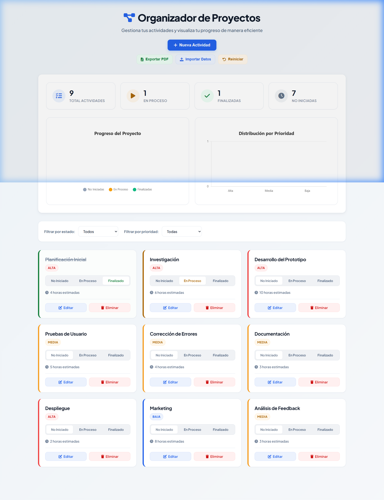
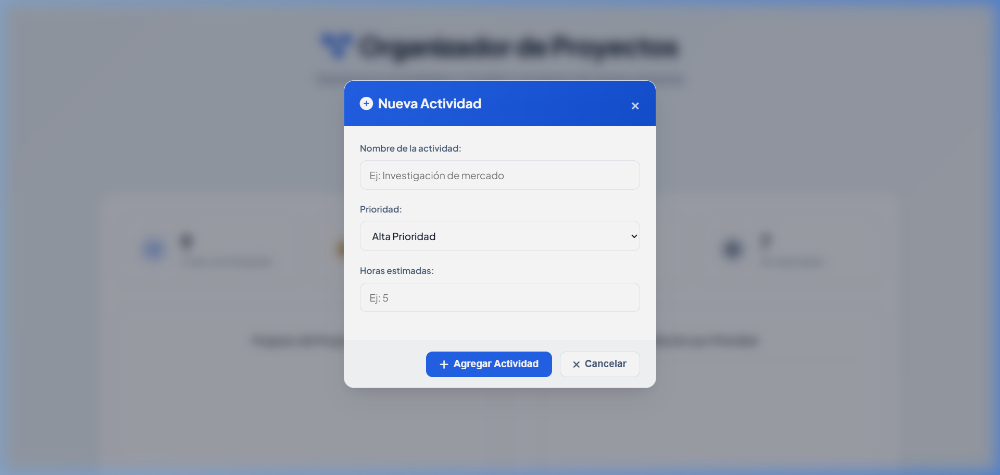
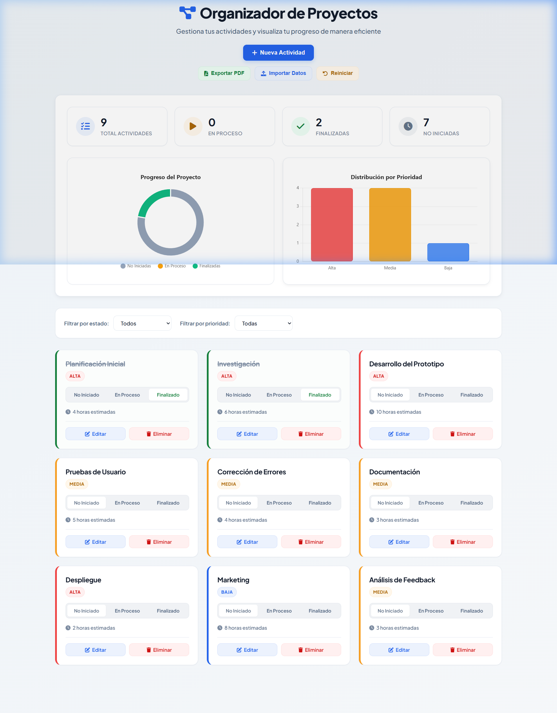

# 🏗️ Organizador de Proyectos Premium

Una herramienta web moderna, elegante e intuitiva diseñada bajo directrices visuales de alta gama (estilo SaaS y Material Design 3) para la gestión ágil de tareas, análisis en tiempo real y exportación de reportes profesionales.

---

## 📸 Vista General del Sistema

### Dashboard Principal (Tema Claro y Oscuro)
La interfaz se adapta automáticamente a las preferencias de tu sistema y permite alternar de forma manual mediante un selector persistente en la cabecera. Cuenta con tarjetas estadísticas con brillos traslúcidos e iconos vectoriales dinámicos.

### Control y Registro de Actividades
El sistema incluye ventanas modales estilizadas con efectos de cristal esmerilado (`backdrop-filter: blur`) para agregar o editar actividades de forma limpia y enfocada.

### Análisis de Progreso y Prioridad
Visualiza la distribución de tareas por estado y nivel de prioridad gracias a los gráficos reactivos de **Chart.js**, los cuales actualizan sus colores de ejes y etiquetas automáticamente en función del tema activo.

---

## ✨ Características Principales

*   **🌓 Tema Dual Persistente**: Selector de tema Claro/Oscuro con persistencia en `localStorage` y detección de preferencias del sistema.
*   **📊 Métricas y Gráficos Reactivos**: Gráfico de rosquilla para progreso general y gráfico de barras para prioridades integrados en tiempo real.
*   **⚡ Lógica de Estados Dinámica**: Botones tipo píldora interactivos para transicionar tareas entre *No Iniciado*, *En Proceso* y *Finalizado*.
*   **📂 Gestión de Datos JSON**: Importa y exporta la base de datos de actividades directamente desde archivos locales `.json`.
*   **📄 Generador de Reportes PDF Optimizado**: Exportación a PDF de alta resolución con gráficos en formato PNG y tablas ordenadas de métricas estimadas en un tamaño de archivo ligero (menos de 2 MB).
*   **🎯 Diseño Adaptativo (Responsive)**: Totalmente optimizado para computadoras, tablets y móviles con transiciones fluidas.

---

## 🛠️ Tecnologías Utilizadas

*   **HTML5 Semántico**: Estructuración limpia y accesible del DOM.
*   **CSS3 Vanilla (Custom Variables)**: Hoja de estilos con arquitectura de variables HSL avanzadas, sombras de profundidad y micro-animaciones en hover/active.
*   **JavaScript (ES6+)**: Clase controladora orientada a objetos `ProjectManager` para la persistencia en `localStorage` y manejo del estado.
*   **Chart.js**: Renderizado interactivo y dinámico de métricas.
*   **jsPDF & html2canvas**: Motor de generación de reportes y captura de elementos en alta resolución.

---

## 🚀 Instrucciones de Uso

No requiere compilación ni servidores de base de datos.
1. Descarga o clona este repositorio.
2. Abre el archivo [index.html](index.html) directamente en tu navegador web de preferencia.
3. Haz clic en **Nueva Actividad** para comenzar a organizar tu proyecto.

---

## 📄 Licencia

Este proyecto está disponible para uso y aprendizaje personal de forma libre. ¡Contribuye y personalízalo como desees!
